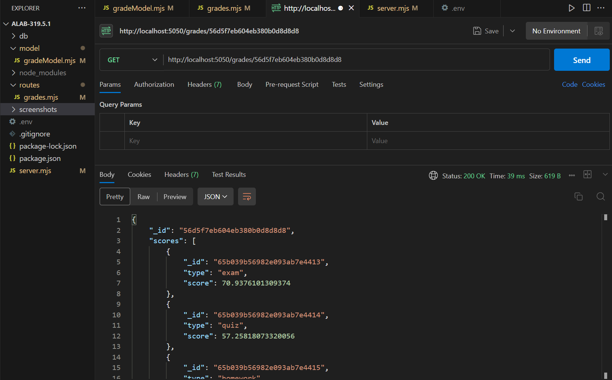
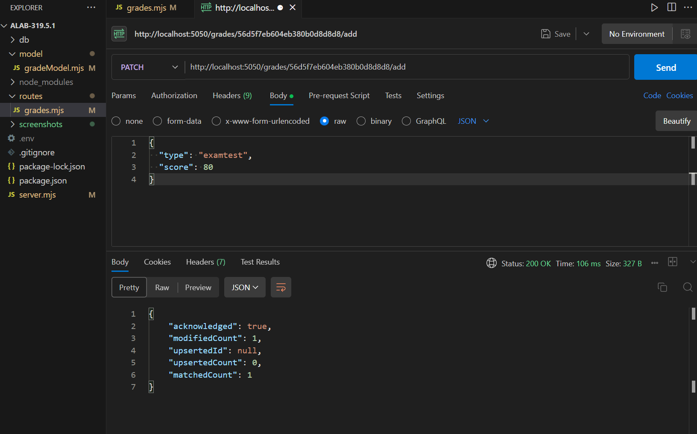
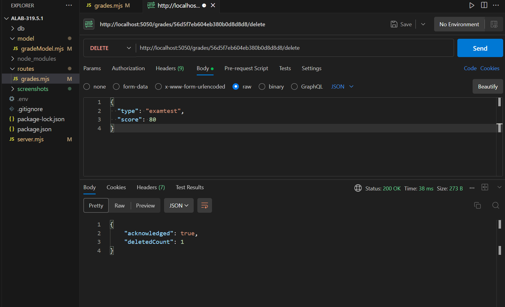
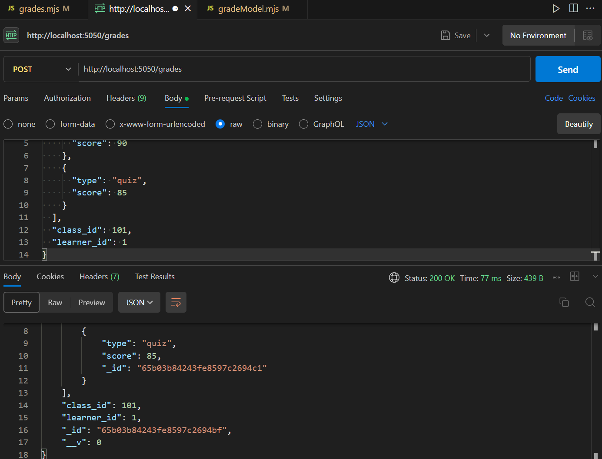
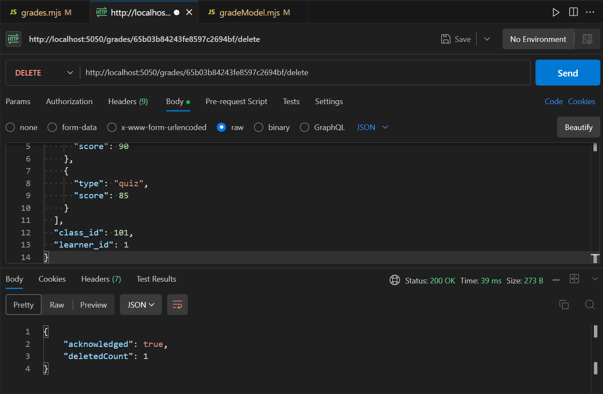

## Some of the route tests in POSTMAN:

1. Get a single grade entry:
   
2. Add a score to a grade entry:
   
3. Remove a score from a grade entry:
   
4. create a single grade entry:
   
5. Delete a single grade entry:
   
